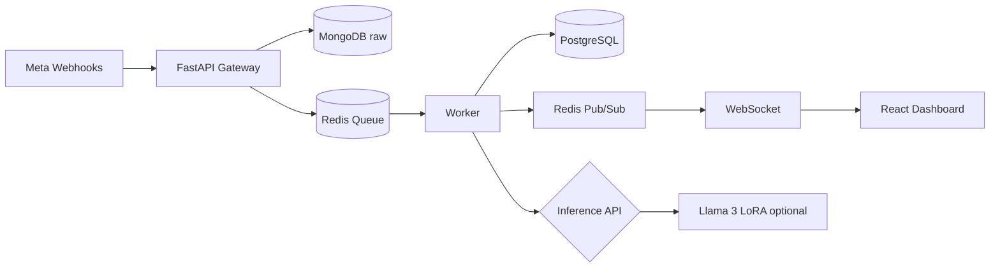

# Code-Mixed Sentiment Intelligence Platform

Affordable social listening for mid-market brands, focused on **Romanized code-mixed** comments (English blended with regional languages). Built from the *Sentinel Sync Project Feasibility* blueprint (rebranded stack—avoid "Sentinel Sync" for trademark reasons).

## What it does

| Layer | Capability |
|--------|------------|
| **Ingestion** | Meta Graph API webhooks → FastAPI gateway → Redis queue |
| **Raw storage** | MongoDB for full webhook JSON |
| **Processing** | Worker: boundary-aware extraction, sarcasm-aware sentiment, language-switch metrics |
| **AI** | Synthetic data + LoRA fine-tune scripts for Llama 3 8B; optional GPU inference service |
| **Analytics** | PostgreSQL + REST metrics + WebSocket live updates |
| **Dashboard** | React: sentiment stream, trends, urgent negative/sarcastic alerts |

## Architecture



## Quick start

### 1. Infrastructure

```bash
docker compose up -d
cp .env.example .env   # edit META_VERIFY_TOKEN as needed
```

### 2. Backend

```bash
cd backend
python -m venv venv && source venv/bin/activate
pip install -r requirements.txt
python init_db.py
uvicorn main:app --reload --port 8000
```

### 3. Worker (second terminal)

```bash
cd backend && source venv/bin/activate
python worker.py
```

### 4. Frontend

```bash
cd frontend
npm install
npm run dev
```

Open [http://localhost:5173](http://localhost:5173).

### 5. Simulate webhooks

```bash
cd backend && python test_webhook.py
```

## Meta developer setup (Week 1)

1. Create a Meta app and add **Webhooks** for your Page / Instagram.
2. Callback URL: `https://<your-domain>/webhook`
3. Verify token: must match `META_VERIFY_TOKEN` in `.env`
4. Subscribe to comment-related fields; request `pages_manage_metadata` and `instagram_manage_comments`.
5. OAuth entry point (when credentials are set): `GET /auth/meta/login`

## AI pipeline (Week 2–3)

```bash
cd ai_pipeline
pip install -r requirements.txt
python generate_data.py          # synthetic code-mixed CSV
python train_lora.py             # GPU: uncomment train/save lines
uvicorn inference_server:app --port 8001
```

Set in `.env`:

```env
INFERENCE_URL=http://localhost:8001/analyze
```

## API

| Method | Path | Description |
|--------|------|-------------|
| GET | `/webhook` | Meta verification |
| POST | `/webhook` | Receive comment events |
| GET | `/api/metrics` | Dashboard summary + trend + recent comments |
| WS | `/ws/dashboard` | Live `comment_processed` events |
| GET | `/auth/meta/login` | Start Meta OAuth |

## Project layout

```
code-mixed-sentiment-platform/
├── backend/           # FastAPI, worker, inference heuristics
├── frontend/          # React dashboard
├── ai_pipeline/       # Synthetic data, LoRA training, inference server
├── docker-compose.yml
├── .env.example
└── scripts/dev_up.sh
```

## Production notes

- Restrict CORS origins in `.env`
- Use secrets management for DB and Meta tokens
- Scale workers horizontally; Redis decouples webhook ACK from inference latency
- Run `inference_server` on GPU for Llama 3 LoRA; heuristics work for local MVP demos
