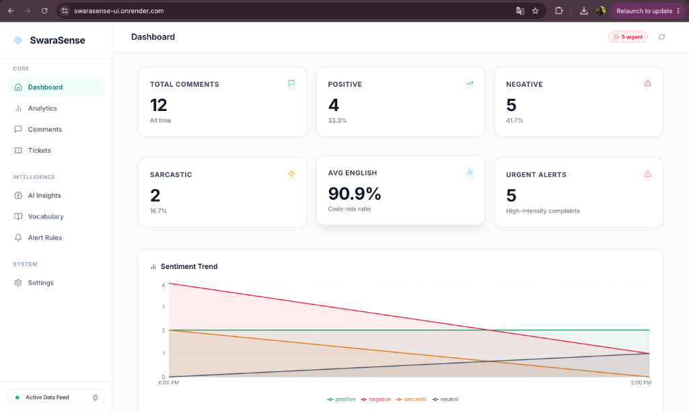
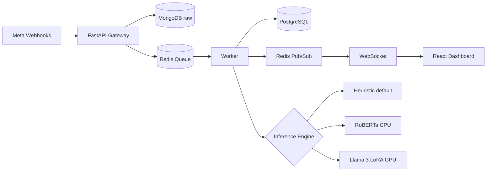

# Code-Mixed Sentiment Intelligence Platform — SentinelAI

> **Affordable social listening for mid-market brands**, focused on **Romanized code-mixed** comments (English blended with Tamil, Malayalam, Hindi, Bengali).

[](https://github.com/your-org/sentiment-platform/actions/workflows/ci.yml)

<div align="center">
  <!-- Replace with actual screenshot path once added to the repository -->
  
</div>

## Key Highlights

- **Multilingual Code-Mixed NLP:** Natively processes Romanized text blending English with 4 regional languages (Tamil, Malayalam, Hindi, Bengali).
- **3-Tier Hybrid AI Architecture:** Automatically scales from a lightning-fast `<1ms` Heuristic engine to RoBERTa CPU and a fine-tuned Llama 3 8B LoRA model.
- **Custom Slang Override & ABSA:** Dynamic vocabulary dictionaries for domain-specific slang, paired with Aspect-Based Sentiment Analysis (ABSA).
- **Proactive Alert Routing:** Real-time Telegram alerts triggered by customizable rule engines targeting urgent friction points.
- **Executive Reporting:** Cron-driven, fully automated weekly PDF business briefings generated directly from the live PostgreSQL database.

---

---

## What it does

| Layer | Capability |
|-------|------------|
| **Ingestion** | Meta Graph API Webhooks → FastAPI gateway → Redis queue |
| **Raw Storage** | MongoDB for full webhook JSON (non-blocking) |
| **Processing** | Worker: boundary-aware extraction, sarcasm detection, language-switch metrics |
| **AI Engine** | 3-tier: Heuristic MVP → RoBERTa CPU (real ML) → Llama 3 8B LoRA (GPU) |
| **Analytics** | Language-switching time series · Brand mentions · English ratio bands · Heatmap |
| **Authentication** | JWT (access + refresh tokens) · bcrypt password hashing |
| **Dashboard** | 6-page React app: Dashboard · Analytics · Comment Explorer · AI Insights · Connect Pages · Settings |
| **Production** | Rate limiting · Security headers · Structured logging · Health checks · Docker |

---

## Architecture



---

## Quick Start

### 1. Start Infrastructure

```bash
cd code-mixed-sentiment-platform
docker compose up -d          # starts PostgreSQL, Redis, MongoDB
```

### 2. Backend

```bash
cd backend
python -m venv venv && source venv/bin/activate
pip install -r requirements.txt
cp ../.env.example ../.env    # edit META_VERIFY_TOKEN, JWT_SECRET_KEY
python init_db.py
uvicorn main:app --reload --port 8000
```

### 3. Worker (second terminal)

```bash
cd backend && source venv/bin/activate
python worker.py
```

### 4. Frontend

```bash
cd frontend
npm install
npm run dev
```

Open **http://localhost:5173**

### 5. Simulate Webhooks

```bash
cd backend && python test_webhook.py
```

---

## AI Pipeline

Three inference tiers, switchable via environment variable:

| Mode | Env Setting | Accuracy | Latency | Requirements |
|------|-------------|----------|---------|--------------|
| **Heuristic** | `INFERENCE_MODE=heuristic` (default) | ~68% | <1ms | None |
| **RoBERTa CPU** | `INFERENCE_MODE=roberta` | ~78% | 200-600ms | `pip install transformers torch` |
| **Llama 3 LoRA** | `INFERENCE_MODE=llama` | ~82-87% | 500-2000ms | GPU (16GB+ VRAM) |

### RoBERTa (CPU) — Recommended for development

```bash
cd ai_pipeline
pip install fastapi uvicorn transformers torch
python roberta_inference.py    # starts on port 8001
```

Then set in `.env`:
```env
INFERENCE_URL=http://localhost:8001/analyze
INFERENCE_MODE=roberta
```

### Llama 3 LoRA (GPU) — Production

```bash
cd ai_pipeline
pip install -r requirements.txt
python generate_data.py --n 20          # generate 1000+ synthetic rows
python train_lora.py --steps 1000       # GPU required
uvicorn inference_server:app --port 8001
```

Then set:
```env
INFERENCE_URL=http://localhost:8001/analyze
INFERENCE_MODE=llama
```

---

## Meta Developer Setup

1. Create a Meta app at https://developers.facebook.com/apps
2. Add **Webhooks** product, set callback URL: `https://your-domain.com/webhook`
3. Set verify token to match `META_VERIFY_TOKEN` in `.env`
4. Subscribe to `feed` and `comments` fields
5. Request permissions: `pages_manage_metadata`, `instagram_manage_comments`, `pages_read_engagement`
6. Add `META_APP_ID` and `META_APP_SECRET` to `.env`
7. Visit `GET /auth/meta/login` to start OAuth

---

## Authentication

```bash
# Register
curl -X POST http://localhost:8000/auth/register \
  -H "Content-Type: application/json" \
  -d '{"email": "you@example.com", "password": "yourpassword"}'

# Login
curl -X POST http://localhost:8000/auth/login \
  -H "Content-Type: application/json" \
  -d '{"email": "you@example.com", "password": "yourpassword"}'

# Use token
curl http://localhost:8000/auth/me \
  -H "Authorization: Bearer <access_token>"
```

---

## API Endpoints

| Method | Path | Description |
|--------|------|-------------|
| GET | `/webhook` | Meta webhook verification |
| POST | `/webhook` | Receive comment events |
| GET | `/api/metrics` | Dashboard summary + trend + recent comments |
| GET | `/api/comments` | Searchable, filterable comment list |
| WS | `/ws/dashboard` | Live WebSocket stream |
| POST | `/auth/register` | Register new user |
| POST | `/auth/login` | Login, get JWT tokens |
| GET | `/auth/me` | Get current user |
| GET | `/auth/meta/login` | Start Meta OAuth |
| GET | `/auth/meta/pages` | List connected pages |
| GET | `/api/analytics/language-switching` | Language switch over time |
| GET | `/api/analytics/heatmap` | Activity heatmap data |
| GET | `/api/analytics/brand-mentions` | Top entity mentions |
| GET | `/api/analytics/export` | CSV export |
| GET | `/health` | Health check |
| GET | `/docs` | Swagger UI |

---

## Testing

```bash
cd backend
pip install pytest httpx
python -m pytest tests/ -v
```

---

## Project Structure

```
code-mixed-sentiment-platform/
├── backend/
│   ├── main.py              # FastAPI app, middleware, all routes
│   ├── worker.py            # Redis queue consumer
│   ├── inference.py         # Heuristic + RoBERTa + Llama dispatch
│   ├── models.py            # SQLAlchemy models (User, Comment, Page, Org, APIKey)
│   ├── schemas.py           # Pydantic schemas
│   ├── routes/
│   │   ├── auth.py          # JWT auth
│   │   ├── meta_auth.py     # Meta OAuth + page management
│   │   └── analytics.py     # Deep analytics APIs
│   ├── tests/
│   │   ├── test_inference.py
│   │   └── test_api.py
│   └── Dockerfile
├── frontend/
│   └── src/
│       ├── pages/           # Dashboard, Analytics, Comments, AI, Connect, Settings
│       ├── components/      # Sidebar, TopBar, UI elements
│       ├── hooks/           # useWebSocket, useMetrics
│       └── api/client.js    # Centralized API client
├── ai_pipeline/
│   ├── generate_data.py     # Synthetic dataset (1000+ rows)
│   ├── train_lora.py        # Llama 3 LoRA fine-tuning
│   ├── inference_server.py  # GPU inference server
│   └── roberta_inference.py # CPU RoBERTa server
├── docker-compose.yml
├── .github/workflows/ci.yml
└── .env.example
```

---

## Production Checklist

- [ ] Set strong `JWT_SECRET_KEY` in `.env`
- [ ] Restrict `CORS_ORIGINS` to your domain
- [ ] Use environment secrets management (AWS Secrets Manager, etc.)
- [ ] Configure HTTPS / reverse proxy (nginx/Caddy)
- [ ] Scale workers horizontally (Redis decouples from inference latency)
- [ ] Set up monitoring (Prometheus/Grafana) and alerts
- [ ] Run `docker compose --profile full up -d` for containerized deployment

---

## License

MIT
